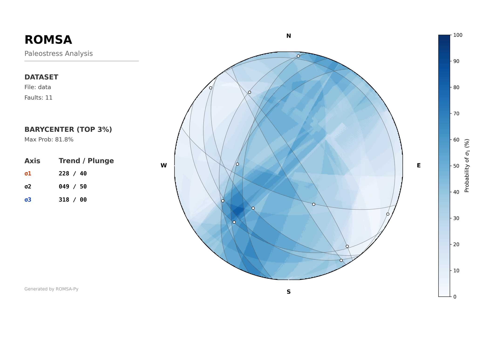

# ROMSA: Paleostress Analysis from Faults

**ROMSA** (Right Dihedra Method Stress Analysis) is a high-performance Python tool for determining paleostress orientations from fault-slip data.

It is a modern re-implementation of the original C++ program published by **Bruno Ciscato** (1994), based on the structural analysis method developed by **Lisle** (1987).


## 📜 History & Evolution

- **1994 (Original):** Written in C++ for Unix/DOS/Windows. It introduced Object-Oriented Programming to geological stress analysis to handle the heavy computational load of evaluating ~500,000 tensors.
- **2025 (Modernization):** Ported to Python 3. Using **Numba** (Just-In-Time compilation), this version achieves the same execution speed as C++ on modern multi-core processors while offering interactive visualisation via **Matplotlib**.

## 🧠 The Method

ROMSA solves the inverse problem of finding the stress tensor that best explains a population of faults measured in the field. It uses a comprehensive grid search rather than numerical inversion, allowing visualisation of the entire solution space and its stability.

### 1. The Right Dihedra Principle

If slickenlines (striae) on a fault represent the direction of maximum resolved shear stress, the principal compressive stress (σ1) must lie within a specific "pressure" quadrant (dihedra), and the principal extension stress (σ3) must lie in the opposing "tension" quadrant. This forms the basis of the Angelier & Mechler (1977) method.

### 2. Lisle's Constraint (The Improvement)

Standard Right Dihedra methods treat σ1 and σ3 independently. Lisle (1987) introduced a kinematic constraint: a specific σ1 orientation is only valid if there exists a corresponding σ3 (perpendicular to it) that *also* satisfies the fault movement.

### 3. The Algorithm

1. **Scan:** The program generates a grid of thousands of potential σ1 orientations on a stereonet.
2. **Check:** For every potential σ1, it scans all orthogonal directions to find the best possible σ3 that satisfies Lisle's constraint for the maximum number of faults.
3. **Map:** The result is a probability map where bright areas represent orientations consistent with the majority of the field data.

## 🛠️ Prerequisites

Before installing ROMSA, you only need **Python** installed on your computer.

### 🪟 Windows

1. Download the **"Windows installer (64-bit)"** from [python.org](https://www.python.org/downloads/).
   - *Crucial:* When installing, check the box at the bottom that says **"Add Python to PATH"**.

### 🍎 macOS

1. Download the **"macOS 64-bit universal2 installer"** from [python.org](https://www.python.org/downloads/macos/).
2. Run the installer.

### 🐧 Linux

Most distributions require you to install **Tkinter** (for the GUI) and **venv** (for the virtual environment) separately.

**Ubuntu / Debian / Mint:**

```bash
sudo apt update
sudo apt install python3 python3-pip python3-venv python3-tk
```

**Fedora / RHEL / CentOS:**

```bash
sudo dnf install python3 python3-pip python3-tkinter
```

**Arch Linux / Manjaro:**

```bash
sudo pacman -S python python-pip tk
```

## ⬇️ Installation

### 1. Download the Software

The easiest way to get ROMSA is to download it as a ZIP file:

1. Scroll to the top of this GitHub page.
2. Click the green **<> Code** button.
3. Select **Download ZIP**.
4. Extract (Unzip) the folder to your Desktop or Documents.

### 2. Open a Terminal

Navigate to the extracted folder using your terminal:

- **Windows 11:** Open the extracted folder. Right-click anywhere in the empty space and select **"Open in Terminal"**.
- **Windows 10:** Open the extracted folder. Hold the **Shift** key, Right-click in the empty space, and select **"Open PowerShell window here"**.
- **macOS:** Open the extracted folder in Finder. Right-click (or Ctrl-click) inside the folder and select **"New Terminal at Folder"**.
- **Linux:** Open the extracted folder in your File Manager. Right-click inside the folder (in the empty white space) and select **"Open in Terminal"**.

### 3. Install Dependencies

Once your terminal is open in the correct folder, run the following command to install the necessary libraries:

**🪟 Windows:**

```text
python -m pip install -r requirements.txt
```

**🍎 macOS**

```text
pip3 install -r requirements.txt
```

**🐧 Linux (Required for Virtual Environment):** *Note: Modern Linux blocks global pip installs. You must create a virtual environment first.*

```text
# 1. Create a virtual environment named 'venv'
python3 -m venv venv

# 2. Activate the environment
source venv/bin/activate

# 3. Install the libraries inside the environment
pip install -r requirements.txt
```

## 💻 Usage

Run the program by pointing it to your data file:

🪟 **Windows:**

```text
python romsa.py examples\data.dat
```

🍎 **macOS:**

```text
python3 romsa.py examples/data.dat
```

🐧 **Linux:** *(Make sure you have activated your environment first: `source venv/bin/activate`)*

```text
python3 romsa.py examples/data.dat
```

### Interactive Interface

After calculation, an interactive window will open with a control panel at the bottom:

- **Hover:** Move your mouse over the stereonet to see the exact **Trend / Plunge** coordinates.

- **Overlays (Top Row):** Toggle the visibility of **Fault Planes**, **Striae**, and **Stress Axes**.

- **Palettes (Bottom Row):** Switch between colour schemes instantly.

### Command Line Arguments

You can control the resolution, colour palette, and **default visibility** of overlays directly from the terminal. This is ideal for generating publication-ready images automatically.

| **Flag** | **Description** |
| :--- | :--- |
| `--res [low/medium/high]` | Set grid resolution. Default: `medium`. |
| `--cmap [Inferno/Viridis/Greys/Blues]` | Set colour palette. Default: `Inferno`. |
| `--faults` | Enable **Fault Plane** traces (Great Circles) on start. |
| `--striae` | Enable **Striae** (Slickensides) dots on start. |
| `--axes` | Enable **Stress Axes** (σ1, σ2, σ3) on start. |

**Example: Generate a high-res plot with all geological data visible:**

**Windows:**
```text
python romsa.py examples\data.dat --res high --faults --striae --axes
```

**Mac / Linux:**
```text
python3 romsa.py examples/data.dat --res high --faults --striae --axes
```

### Automatic Outputs

ROMSA automatically generates two files in the same folder as your input data:

1. **`filename_plot.png`**: A high-resolution (300 DPI) image.
   
   - *Note:* This image captures the state defined by your CLI flags (e.g., if you run with `--faults`, the saved image will include fault planes).

2. **`filename_tensors.csv`**: A spreadsheet containing the calculated stress tensors sorted by probability.

## 📄 Input File Format

The input `.dat` file is a plain text file compatible with the original 1994 software.

- **Header (Optional):** The first line can be the integer count of faults. If omitted, the program auto-detects it.
- **Data:** Each row represents one fault with six columns:

| Column | Parameter      | Description                                                     |
| ------ | -------------- | --------------------------------------------------------------- |
| 1      | **Dip** | Fault plane dip (0-90).                                         |
| 2      | **Dip Dir** | Fault plane dip direction (0-360).                              |
| 3      | **Plunge** | Striae plunge (0-90).                                           |
| 4      | **Trend** | Striae trend/direction (0-360).                                 |
| 5      | **Vertical** | Sense of slip: `1` (Normal), `-1` (Reverse), `0` (Strike-Slip). |
| 6      | **Horizontal** | Sense of slip: `1` (Dextral), `-1` (Sinistral), `0` (Dip-Slip). |

### 💡 Striae Visualization & Input Verification

The interactive plot distinguishes striae based on the geometry derived from your input columns:

- **White dots:** Standard measurements (Normal, Dextral).
- **Black dots:** "Inverted" measurements (Reverse, Sinistral).

*This visual distinction is particularly useful for verifying that your **Vertical/Horizontal slip sense** (Columns 5 & 6) produces the expected kinematic orientation.*

**Example `data.dat`:**

```text
11
10 52 4 116 1 0
54 290 53 272 1 0
55 302 35 242 1 0
40 280 28 332 1 0
85 240 6 151 -1 0
82 56 14 144 1 0
58 278 4 5 1 0
37 232 4 315 1 0
69 200 57 147 1 0
32 214 32 224 1 0
50 231 50 220 -1 0
```

## 📚 References

1. **Ciscato, B. (1994).** *Principal Stress Orientations from Faults: a C++ program*. Structural Geology and Personal Computers, 325-342.
2. **Lisle, R. J. (1988).** *ROMSA: a basic program for paleostress analysis using fault-striation data*. Computers & Geosciences 14: 255-259.
3. **Lisle, R. J. (1987).** *Principal stress orientations from faults: an additional constraint*. Annales Tectonicae 1: 155-158.
4. **Angelier, J. & Mechler, P. (1977).** *Sur une méthode graphique de recherche des contraintes principales...*. Bull. Soc. Geol. France 19: 1309-1318.
5. **McKenzie, D. P. (1969).** *The relation between fault plane solutions and the directions of the principal stresses*. Bull. Seismolog. Soc. America 59: 591-601.

## 📄 License

This project is licensed under the MIT License.

## 📰 Citation

If you use ROMSA in your research, please cite both the code and the original paper:

**The Code:**

> Ciscato, B. (2025). ROMSA: Right Dihedra Method Stress Analysis (Python) [Computer software]. https://github.com/bciscato/romsa-py

**The Methodology:**

> Ciscato, B. (1994). Principal Stress Orientations from Faults: a C++ program. Structural Geology and Personal Computers, 325-342.

## 💾 Gallery

***Community contributions are welcome! Feel free to submit your plots to be featured here.***

Just open a Pull Request with your image added to the examples folder or simply **[open a new Issue](https://github.com/bciscato/romsa-py/issues)** and drag-and-drop your image into the description.


Fig. 1 - Example from the 1994 paper (data.dat above) rendered in the Blues colour palette. Unpublished data by Harper.
